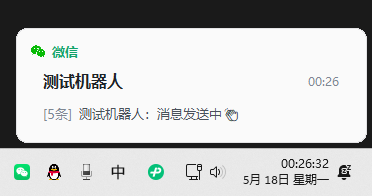

# wechat-toast

适用于 Windows 的微信 4.x 桌面消息弹窗提醒工具，支持浮层通知/win系统通知。

本项目基于 [fenqijun/wechat-notifier](https://github.com/fenqijun/wechat-notifier) 修改而成，当前版本主要面向微信 4.x，重点优化了未读会话扫描、本地浮层通知样式和回退探测逻辑。

## 功能

- 支持微信桌面版 4.x
- 只提醒未读消息，尽量避免误读自己发出的内容
- 默认使用本地浮层通知，也支持 Windows 系统通知
- 同一会话连续来消息时，会直接刷新同一张通知卡片
- 显示未读数量和最新一条消息摘要
- 支持过滤折叠聊天、公众号、服务号、免打扰等干扰项

## 示例图



## 运行环境

- Windows 10 / 11
- 微信桌面版 4.x
- Python 3.10+（推荐）

## 安装依赖

```powershell
pip install -r requirements.txt
```

## 启动方式

```powershell
python .\wechat-toast.py
```

如果你使用项目内虚拟环境：

```powershell
.\.venv\Scripts\python.exe .\wechat-toast.py
```

## 打包成可执行文件

如果你要把它发给终端用户，推荐直接打成单文件 `exe`。

### 方式一：一键打包

项目里已经提供了 PowerShell 打包脚本：

```powershell
.\build.ps1
```

打包完成后，生成文件位于：

```text
.\dist\wechat-toast.exe
```

图标文件位于 `packaging/wechat-toast.ico`，版本信息位于 `packaging/version_info.txt`。

### 方式二：手动打包

```powershell
pip install pyinstaller
pyinstaller --noconfirm --clean --onefile --windowed --name wechat-toast `
  --icon .\packaging\wechat-toast.ico `
  --version-file .\packaging\version_info.txt `
  --add-binary '.\.venv\Lib\site-packages\uiautomation\bin\UIAutomationClient_VC140_X64.dll;uiautomation\bin' `
  --add-binary '.\.venv\Lib\site-packages\uiautomation\bin\UIAutomationClient_VC140_X86.dll;uiautomation\bin' `
  .\wechat-toast.py
```

### 交付给用户时的说明

- 直接把 `dist\wechat-toast.exe` 发给用户即可
- 用户机器需要是 Windows 10 / 11
- 用户机器上需要已经安装并登录微信桌面版 4.x
- 第一次运行时，Windows 可能会弹出安全提示，允许后即可使用
- 程序启动后会常驻任务栏通知区域，右键托盘图标可退出
- 程序日志会写到 `wechat-toast.log`，位置和 `exe` 在同一目录，方便排查问题

## 常用配置

配置位于 [wechat-toast.py](./wechat-toast.py) 顶部。

- `NOTIFICATION_MODE = "overlay"`：本地浮层通知，默认推荐
- `NOTIFICATION_MODE = "system"`：Windows 系统通知
- `WECHAT_NOTIFIER_LOG_LEVEL=DEBUG`：开启调试日志

## 已知问题

当前版本已经可以满足基本使用，但仍有以下已知问题：

1. 只有当微信主界面处于前台可见状态时，程序才能稳定生效。  
   未显示在前台时参考：  
   已显示在前台时参考：

2. 点击通知后，目前可以拉起微信主窗口，但还不能自动精确定位到对应会话，后续会继续考虑修复。

3. 当微信当前停留在文章页、内置浏览器页或类似网页视图时，程序可能无法读取聊天会话列表，因此这段时间不会弹出新消息提醒；关闭该页面或切回聊天主界面后，提醒能力会恢复。

4. 当鼠标悬浮在任务栏中闪烁的微信图标上时，可能会再次触发一次通知，后续会继续考虑修复。

## 更新记录

### 当前版本

- 合并为单文件入口 `wechat-toast.py`
- 完全转向微信 4.x 桌面版适配
- 重做本地浮层通知样式与布局
- 增强未读会话探测与多层回退逻辑
- 将微信图标内嵌到代码中，不再依赖额外图片文件

## 致谢

- 上游项目：[fenqijun/wechat-notifier](https://github.com/fenqijun/wechat-notifier)
- 本项目当前版本的设计、调试、重构与实现过程，全程主要通过 Codex 协作完成
